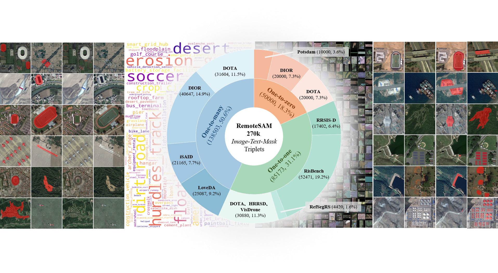
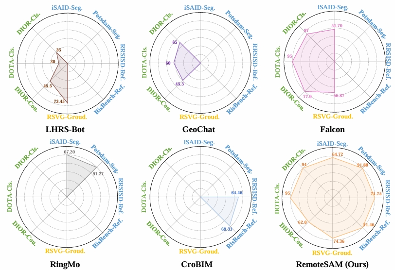

<div align="center">

# RemoteSAM: Towards Segment Anything for Earth Observation


[Liang Yao (姚亮)*](https://multimodality.group/author/%E5%A7%9A%E4%BA%AE/) 
, &nbsp; &nbsp; 
[Fan Liu (刘凡)*](https://multimodality.group/author/%E5%88%98%E5%87%A1/) ✉ 
, &nbsp; &nbsp;
[Delong Chen (陈德龙)*](https://chendelong.world/) 
, &nbsp; &nbsp;

[Chuanyi Zhang (张传一)](https://ai.hhu.edu.cn/2023/0809/c17670a264073/page.htm) ✉ 
, &nbsp; &nbsp;
[Yijun Wang (王翌骏)](https://multimodality.group/author/%E7%8E%8B%E7%BF%8C%E9%AA%8F/) 
, &nbsp; &nbsp;
[Ziyun Chen (陈子赟)](https://multimodality.group/author/%E9%99%88%E5%AD%90%E8%B5%9F/) 
, &nbsp; &nbsp;

[Wei Xu (许玮)](https://multimodality.group/author/%E8%AE%B8%E7%8E%AE/) 
, &nbsp; &nbsp; 
[Shimin Di (邸世民)](https://cs.seu.edu.cn/shimindi/main.htm) 
, &nbsp; &nbsp; 
[Yuhui Zheng (郑钰辉)](https://faculty.nuist.edu.cn/zhengyuhui/en/index.htm) 


\*  *Equal Contribution*    ✉ *Corresponding Author*

Model : 🤗[RemoteSAM](https://huggingface.co/1e12Leon/RemoteSAM) 

Dataset : 🤗[RemoteSAM-270K](https://huggingface.co/datasets/1e12Leon/RemoteSAM_270K)
</div>


## News

- **2025/5/7**: We have released the model and dataset! You can download RemoteSAM-270K from 🤗[RemoteSAM-270K](https://huggingface.co/datasets/1e12Leon/RemoteSAM_270K) and checkpoint from 🤗[RemoteSAM](https://huggingface.co/1e12Leon/RemoteSAM).
- **2025/5/3**: Welcome to RemoteSAM! The preprint of our paper is available. Dataset and model are open-sourced at this repository.


## Introduction
Welcome to the official repository of our paper "RemoteSAM: Towards Segment Anything for Earth Observation" !


Recent advances in AI have revolutionized Earth observation, yet most remote sensing tasks still rely on specialized models with fragmented interfaces. To address this, we present **RemoteSAM**, a vision foundation model that unifies pixel-, region-, and image-level tasks through a novel architecture centered on Referring Expression Segmentation (RES). Unlike existing paradigms—task-specific heads with limited knowledge sharing or text-based models struggling with dense outputs—RemoteSAM leverages pixel-level predictions as atomic units, enabling upward compatibility to higher-level tasks while eliminating computationally heavy language model backbones. This design achieves an order-of-magnitude parameter reduction (billions to millions), enabling efficient high-resolution data processing.



We also build **RemoteSAM-270K** dataset, a large-scale collection of 270K Image-Text-Mask triplets generated via an automated pipeline powered by vision-language models (VLMs). This dataset surpasses existing resources in semantic diversity, covering 1,000+ object categories and rich attributes (e.g., color, spatial relations) through linguistically varied prompts. We further introduce RSVocab-1K, a hierarchical semantic vocabulary to quantify dataset coverage and adaptability.



## Setting Up

The code has been verified to work with PyTorch v1.13.0 and Python 3.8.
1. Clone this repository.
2. Change directory to root of this repository.

### Package Dependencies
1. Create a new Conda environment with Python 3.8 then activate it:
```shell
conda create -n RemoteSAM python==3.8
conda activate RemoteSAM
```

2. Install PyTorch v1.13.0 with a CUDA version that works on your cluster/machine (CUDA 11.6 is used in this example):
```shell
pip install torch==1.13.0+cu116 torchvision==0.14.0+cu116 torchaudio==0.13.0 --extra-index-url https://download.pytorch.org/whl/cu116
```

3. Install mmcv from openmmlab:
```shell
pip install mmcv-full==1.7.1 -f https://download.openmmlab.com/mmcv/dist/cu116/torch1.13.0/index.html
```
4. Install the packages in `requirements.txt` via `pip`:
```shell
pip install -r requirements.txt
```
### The Initialization Weights for Training
1. Create the `./pretrained_weights` directory where we will be storing the weights.
```shell
mkdir ./pretrained_weights
```
2. Download [pre-trained classification weights of the Swin Transformer](https://github.com/SwinTransformer/storage/releases/download/v1.0.0/swin_base_patch4_window12_384_22k.pth),
and put the `pth` file in `./pretrained_weights`.
These weights are needed for training to initialize the model.
   
## Data Preparation
We perform all experiments based on our proposed dataset RemoteSAM-270K. 

### Usage
1. Download our dataset from [HuggingFace](https://huggingface.co/datasets/1e12Leon/RemoteSAM_270K).
2. Copy all the downloaded files to `./refer/data/`. The dataset folder should be like this:
```
$DATA_PATH
├── RemoteSAM-270K
│   ├── JPEGImages
│   ├── Annotations
└────  ├── refs(unc).p
       ├── instances.json
```


## RemoteSAM

### Training
We use DistributedDataParallel from PyTorch for training. To run on 8 GPUs on a single node:
More training setting can be change in args.py.
```shell
CUDA_VISIBLE_DEVICES=0,1,2,3,4,5,6,7 \
      python -m torch.distributed.launch \
      --nproc_per_node 8 --master_port 12345 train.py \
      --epochs 40 --img_size 896 2>&1 | tee ./output
```
### Getting Started

To get started with RemoteSAM, please first initialize a model and load the RemoteSAM checkpoint with a few lines of code:

```python
from tasks.code.model import RemoteSAM, init_demo_model
import cv2
import numpy as np

device = 'cuda:0'
checkpoint = "./pretrained_weights/checkpoint.pth"

model = init_demo_model(checkpoint, device)
model = RemoteSAM(model, device, use_EPOC=True)
```

Then, you can explore different tasks with RemoteSAM via:

- **Referring Expression Segmentation** 

```python
image = cv2.imread("./assets/demo.jpg")
mask = model.referring_seg(image=cv2.cvtColor(image, cv2.COLOR_BGR2RGB), sentence="the airplane on the right")
```

- **Semantic Segmentation** 

```python
image = cv2.imread("./assets/demo.jpg")
result = model.semantic_seg(image=cv2.cvtColor(image, cv2.COLOR_BGR2RGB), classnames=['airplane', 'vehicle'])
for classname in ["airplane", "vehicle"]:
    mask = result[classname]
```

- **Object Detection** 

```python
image = cv2.imread("./assets/demo.jpg")
result = model.detection(image=cv2.cvtColor(image, cv2.COLOR_BGR2RGB), classnames=['airplane', 'vehicle'])
for classname in ["airplane", "vehicle"]:
    boxes = result[classname]
```

- **Visual Grounding** 

```python
image = cv2.imread("./assets/demo.jpg")
box = model.visual_grounding(image=cv2.cvtColor(image, cv2.COLOR_BGR2RGB), sentence="the airplane on the right")
```

- **Multi-label classification** 

```python
image = cv2.imread("./assets/demo.jpg")
result = model.multi_label_cls(image=cv2.cvtColor(image, cv2.COLOR_BGR2RGB), classnames=['airplane', 'vehicle'])
print(result)
```

- **Image Classification** 

```python
image = cv2.imread("./assets/demo.jpg")
result = model.multi_class_cls(image=cv2.cvtColor(image, cv2.COLOR_BGR2RGB), classnames=['airplane', 'vehicle'])
print(result)
```

- **Image Captioning** 

```python
image = cv2.imread("./assets/demo.jpg")
result = model.captioning(image=cv2.cvtColor(image, cv2.COLOR_BGR2RGB), classnames=['airplane', 'vehicle'], region_split=9)
print(result)
```

- **Object Counting** 

```python
image = cv2.imread("./assets/demo.jpg")
result = model.counting(image=cv2.cvtColor(image, cv2.COLOR_BGR2RGB), classnames=['airplane', 'vehicle'])
for classname in ["airplane", "vehicle"]:
    print("{}: {}".format(classname, result[classname]))
```

### Evaluation

- **Evaluation of Referring Expression Segmentation** 

```shell
bash tasks/REF.sh
```

- **Evaluation of Semantic Segmentation** 

```shell
bash tasks/SEG.sh
```

- **Evaluation of Object Detection** 

```shell
bash tasks/DET.sh
```
- **Evaluation of Visual Grounding** 

```shell
bash tasks/VG.sh
```
- **Evaluation of Multi-label classification** 

```shell
bash tasks/MLC.sh
```
- **Evaluation of Image classification** 

```shell
bash tasks/MCC.sh
```
- **Evaluation of Image Captioning** 

```shell
bash tasks/CAP.sh
```
- **Evaluation of Object Counting** 

```shell
bash tasks/CNT.sh
```

## Acknowledge
- Thanks Lu Wang (王璐) for his efforts on the RemoteSAM-270K dataset.
- Code in this repository is built on [RMSIN](https://github.com/Lsan2401/RMSIN). We'd like to thank the authors for open sourcing their project.

## Contact
Please Contact yaoliang@hhu.edu.cn


## Cite
If you find this work useful, please cite our paper as:
```bibtex

```